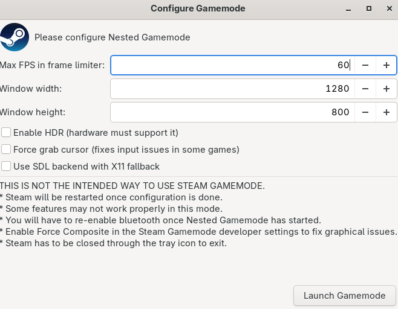

# Nested Steam Gamemode
> credit to [hikariknight](https://github.com/HikariKnight) for the excellent [`bazzite-dx` PR](https://github.com/ublue-os/bazzite-dx/pull/125/files#diff-95375a553164600a7d4fed6d71470c5acd8aaee35a96ac0f99bf0ff7461be5a3R1-R67) that introduced this feature.

Launch Steam's Game Mode UI inside a nested Gamescope window on any Linux distribution. Handy for testing without logging out of your desktop session.

## Why Do I want Nested Gamemode?

I primarily use this to test Decky Loader plugins and more accurately see how a SteamDeck will behave when testing plugins. The nice thing about Nested Gamemode session is the QAM (Quick Access Menu) can be summoned both from within the Steam Big Picture UI, but also while a game is running (Nexus + A on a controller). 



If testing a Decky plugin that depends on a game running, then this is a good way to see the QAM interact with the game as a single screen, almost like a steam deck in a single window!


Example of a plugin where testing while in-game is necessary:


## Requirements

### Required Dependencies

All of these must be installed before running the setup script:

- **Steam** - The Steam client (`steam` command)
- **Gamescope** - Valve's gaming compositor ([GitHub](https://github.com/ValveSoftware/gamescope))
- **YAD** - Yet Another Dialog for the configuration UI ([GitHub](https://github.com/v1cont/yad))

### Optional Dependencies

- **MangoHud** - Performance overlay and monitoring (provides `mangoapp` binary, highly recommended)

### Installation by Distribution

**Arch Linux / Manjaro:**
```bash
sudo pacman -S gamescope mangohud yad steam
```

**Fedora:**
```bash
sudo dnf install gamescope mangohud yad steam
```

**Ubuntu / Debian:**
```bash
sudo apt install gamescope mangohud yad steam
```
*Note: Gamescope may require additional repositories or PPAs on Ubuntu/Debian*

**Other Distributions:**
Install the equivalent packages using your distribution's package manager.

The setup script will check for all required dependencies and warn about optional ones if they are missing.

## Install

```bash
git clone https://github.com/xXJSONDeruloXx/nested-gamemode.git
cd nested-gamemode
sudo ./setup.sh                # installs to ~/.local/bin and ~/.local/share/applications
sudo ./setup.sh --system  # optional system-wide install
```

Add `--no-refresh` if your desktop database update hangs.

## Uninstall

```bash
./uninstall.sh                # removes user install
sudo ./uninstall.sh --system  # removes system-wide install
```

`--no-refresh` is also available during uninstall.

## Usage

- Launch `Nested Steam Gamemode` from your desktop menu, or run `gamemode-nested`.
- Configure frame limiter, window size, and HDR support via the dialog.
- Steam is stopped if it is already running, then restarted inside Gamescope.

To customize the Steam executable or arguments, set `STEAM_EXECUTABLE` or `STEAM_ARGS` before running the launcher.

## Debugging

Set `NESTED_DEBUG=1` and optionally `NESTED_DEBUG_LOG=/path/to/log` before running to capture verbose output:

```bash
NESTED_DEBUG=1 gamemode-nested
```

The launcher echoes the full Gamescope command so you can replay it manually for troubleshooting.

On X11 sessions the launcher automatically appends `--backend sdl --nested` to Gamescope; set `GAMESCOPE_CMD` yourself to override the defaults entirely.

If Steam takes too long to close before relaunch, override the shutdown wait (default 30s):

```bash
STEAM_SHUTDOWN_TIMEOUT=5 gamemode-nested
```
